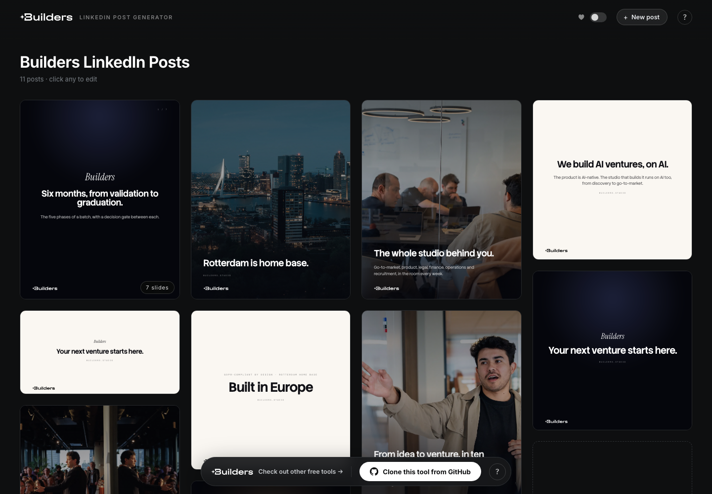

# LinkedIn Post Studio

Make on-brand LinkedIn posts in your browser. You get a gallery of designed post
templates for your brand: click any post, rewrite the copy, switch the background,
and download a crisp PNG, a carousel PDF, or a short animated video.

No design tool, no account, no server. Everything runs in your browser and your
edits stay on your computer.

A [Builders Studio](https://builders.studio) toolkit. Part of toolkit.builders.studio.

## Start in two minutes

You need the folder on your computer and a browser. That is all.

1. **Get the folder.** On this repo's GitHub page, click the green **Code** button,
   then **Download ZIP**. Unzip it anywhere (Desktop is fine).
2. **Start it.**
   - **Mac:** double-click `start-mac.command`. The first time, macOS may block it
     because it came from the internet: right-click the file, choose **Open**, confirm.
   - **Windows:** double-click `start-windows.bat`. If it says Python is missing,
     install it free from [python.org/downloads](https://www.python.org/downloads/)
     (tick "Add python.exe to PATH" during install) and double-click again.
   - **Linux / terminal people:** `python3 -m http.server --bind 127.0.0.1 8911` in the
     folder, then open http://localhost:8911 (any free port works)
3. **Use it.** Your browser opens the studio with the built-in Builders brand. The
   window prints the address, something like `http://localhost:41311` — a free port
   picked the first time you start it and remembered in `.dev-port`, so the link stays
   the same and you can bookmark it. If something else grabs that port later, the studio
   quietly picks another.
   Click any post to edit it. The `?` button in the top-right explains every
   control.

Keep the small black window open while you work; closing it stops the studio.
Your edits are saved automatically in the browser, so next time you start it,
everything is where you left it.

> Why is there a "start" step at all? The studio is a plain folder of web pages,
> and browsers only allow some of its features (like loading your brand file)
> when pages are served over http. The start script runs a tiny web server that
> ships with your computer. Nothing is installed and nothing goes online. The server
> binds to `127.0.0.1`, so it is reachable from this machine only — not from anyone
> else on the same wifi.

### No-download option: host it on GitHub Pages

The studio is 100% static, so GitHub can host it for you for free:

1. Fork this repo (or push your customized copy).
2. In the repo: **Settings → Pages → Source: Deploy from a branch → main / root**.
3. Your studio is live at `https://<you>.github.io/<repo>/` a minute later.
   Share that link with your whole team; no one needs to download anything.

Note that anyone with the link can open a GitHub Pages site, so only host a
brand you are comfortable being public.

## What you can do

- **Edit any text** by clicking it, right on the post.
- **Change the background**: brand color swatches, abstract art, your photos,
  and a blur toggle for photo backdrops.
- **Remove any block**: hover a line, a logo, or an illustration and click its ✕.
- **Switch sizes**: square 1080, portrait 4:5, landscape 1.91:1. Your text
  survives the switch and the typography rescales.
- **Carousels**: reorder slides by dragging, duplicate or delete slides,
  export the whole thing as a PDF (the format LinkedIn expects for carousels).
- **Export**: PNG at 2× resolution, carousel PDF, or a subtle 6-second video.
- **Favourites, duplicates, removals** on the gallery. Nothing is ever truly
  lost: "Reset to original" restores any built-in post.

## Make it your brand

The built-in brand is Builders, the studio that made this tool. Making it yours
is three steps and needs no build tools; the full walkthrough is in
[CUSTOMIZE.md](CUSTOMIZE.md):

1. Duplicate `brands/builders` to `brands/<yourname>` and drop your logo and
   photos into its `assets/` folder.
2. Open the new folder's `studio.mjs` in any text editor. It is written as a
   guided form: palette, fonts, logo, backgrounds, starter posts.
3. Add `<yourname>` to the list in `brands/registry.mjs`. The first brand in
   that list is the one the tool opens with.

Then open `studio/?v=<yourname>`. To check everything works, open
`studio/test.html?v=<yourname>`; a green box means posts render and export.

### The fast lane: let Claude do it

This tool is built to be driven by an AI coding assistant. Open the folder in
[Claude Code](https://claude.com/claude-code) and say, for example:

> Set this studio up for my brand. Our website is example.com. Use our logo,
> colors and tone, and write 10 starter posts about what we do.

The included [AGENTS.md](AGENTS.md) teaches Claude how the tool works, so it can
build your brand file, add new post designs, or invent new layouts on request.

## Troubleshooting

- **Mac says the start file "cannot be opened".** Right-click it, choose
  **Open**, then confirm. macOS asks this once for downloaded files.
- **Mac offers to install "command line developer tools".** Accept; that free,
  one-time install includes the small web server the start script uses. Then
  double-click the start file again.
- **Windows flashes a window and nothing happens.** Python is probably missing;
  see the install note above.
- **The page is a file listing, not the studio.** You opened the wrong folder;
  start the script from the folder that contains `index.html`.
- **Fonts look slightly off.** The fonts load from Google Fonts, so the first
  open needs an internet connection. After that the browser caches them.
- **"Address already in use".** Something else is using the port. The Mac script
  hops to the next free port on its own; on Windows, close the other window or
  edit the `PORT` line in `start-windows.bat`.
- **My edits disappeared.** Edits live in the browser you made them in. A
  different browser, a private window, or clearing site data starts fresh.

## How it is built

Plain HTML, CSS and JavaScript modules; nothing to install, nothing to build.
The editor engine is `studio/studio.mjs`. Everything brand-specific lives in one
file per brand under `brands/`, so designers and copywriters only ever touch
their brand file. Exports are rendered in the browser by
[html-to-image](https://github.com/bubkoo/html-to-image) (PNG) and
[jsPDF](https://github.com/parallax/jsPDF) (PDF), both vendored, both MIT.

House rule for anything you publish: real content only. Never invent metrics,
customers, or quotes. Every number in the built-in Builders posts is real; keep
that standard for your own brand.

## License

MIT. Use it, fork it, rebrand it, ship it. See [LICENSE](LICENSE).
